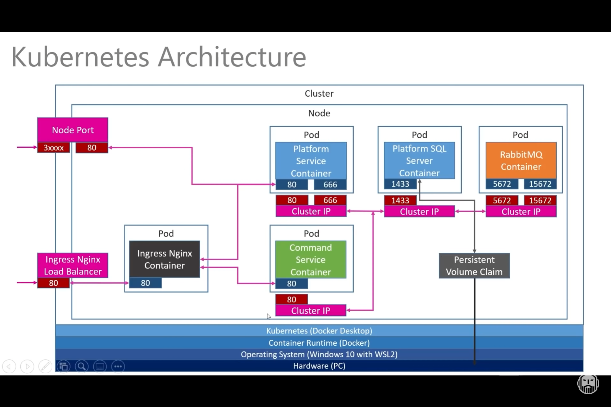

# dotnet-on-k8s
An end-to-end dotnet microservices architecture with k8s, SQL Server on Linux, RabbitMQ and gRPC.

> Built from scratch with: [link](https://www.youtube.com/watch?v=DgVjEo3OGBI)

## Solution Architecture

Overall solution Architecture


### Service 1: Platform


### Service 2: Command Service


### Kubernetes Deployment


---

## Microk8s setup

Run these in local **PowerShell in _Admin mode_** to spin up via Multipass:

> Run with Docker Desktop turned off so `microk8s-vm` has no trouble booting up

**Multipass notes**
* `Multipassd` is the main binary available here: C:\Program Files\Multipass\bin
* Default VM files end up here: C:\Windows\System32\config\systemprofile\AppData\Roaming\multipassd


```PowerShell
# Delete old one (if any)
multipass list
multipass delete microk8s-vm
multipass purge

# Single node K8s cluster
# Latest releases: https://microk8s.io/docs/release-notes
microk8s install "--cpu=4" "--mem=8" "--disk=10" "--channel=1.22/stable" -y

# Launched: microk8s-vm
# 2022-03-05T23:05:51Z INFO Waiting for automatic snapd restart...
# ...

# Allow priveleged containers
multipass shell microk8s-vm
# This shells us in

sudo bash -c 'echo "--allow-privileged" >> /var/snap/microk8s/current/args/kube-apiserver'

exit # Exit out from Microk8s vm

# Start microk8s
microk8s status --wait-ready

# Get IP address of node for MetalLB range
microk8s kubectl get nodes -o wide
# NAME          STATUS   ROLES    AGE   VERSION                    INTERNAL-IP      EXTERNAL-IP   OS-IMAGE             KERNEL-VERSION       CONTAINER-RUNTIME
# microk8s-vm   Ready    <none>   75s   v1.22.6-3+7ab10db7034594   172.23.170.128      <none>        Ubuntu 18.04.6 LTS   4.15.0-169-generic   containerd://1.5.2

# Enable features needed for arc
microk8s enable dns storage metallb ingress
# Enter CIDR for MetalLB: 172.23.170.200-172.23.170.220
# This must be in the same range as the VM above!

# Access via kubectl in this container
$DIR = "C:\Users\mdrrahman\Documents\GitHub\dotnet-on-k8s\microk8s"
microk8s config view > $DIR\config # Export kubeconfig
```

Turn on Docker Desktop.

Now we go into our VSCode Container:

```bash
rm -rf $HOME/.kube
mkdir $HOME/.kube
cp microk8s/config $HOME/.kube/config
dos2unix $HOME/.kube/config
cat $HOME/.kube/config

# Check kubectl works
kubectl get nodes
# NAME          STATUS   ROLES    AGE   VERSION
# microk8s-vm   Ready    <none>   29m   v1.22.6-3+7ab10db7034594
kubectl get pods --all-namespaces
# NAMESPACE        NAME                                       READY   STATUS    RESTARTS   AGE
# kube-system      coredns-7f9c69c78c-s9mnr                   1/1     Running   0          27m
# kube-system      calico-kube-controllers-7bb79d6cbc-rgtm7   1/1     Running   0          29m
# kube-system      calico-node-kgd6n                          1/1     Running   0          29m
# kube-system      hostpath-provisioner-566686b959-v2dk6      1/1     Running   0          26m
# metallb-system   speaker-vfmsj                              1/1     Running   0          24m
# metallb-system   controller-559b68bfd8-jw4x4                1/1     Running   0          24m
# ingress          nginx-ingress-microk8s-controller-lbs8t    1/1     Running   0          23m
kubectl get storageclass
# NAME                          PROVISIONER            RECLAIMPOLICY   VOLUMEBINDINGMODE   ALLOWVOLUMEEXPANSION   AGE
# microk8s-hostpath (default)   microk8s.io/hostpath   Delete          Immediate           false                  27m
```

---

# Gotchas

If VSCode namespaces aren't found - we need to restart OmniSharp.

`CTRL + SHIFT + P` -> `Restart Omnisharp`. 

