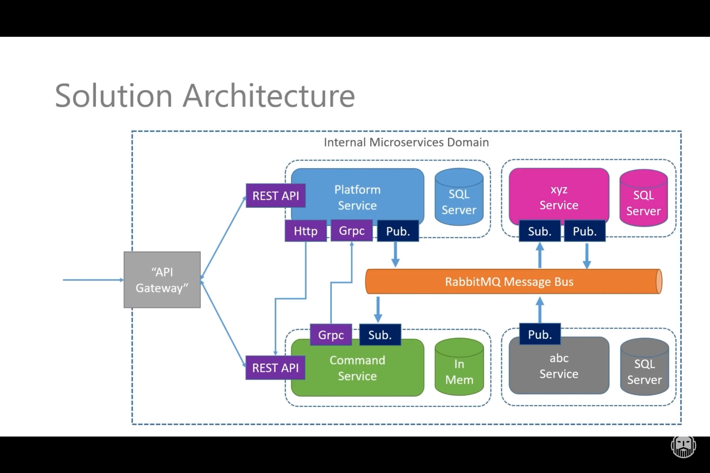
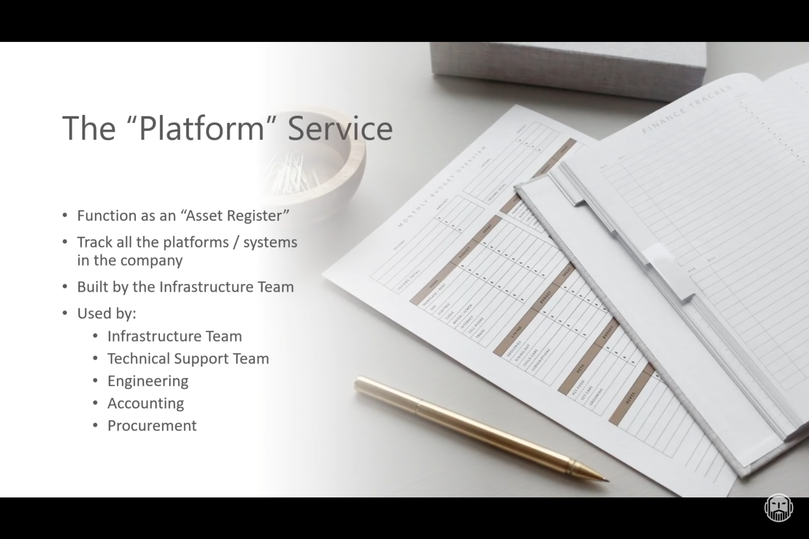
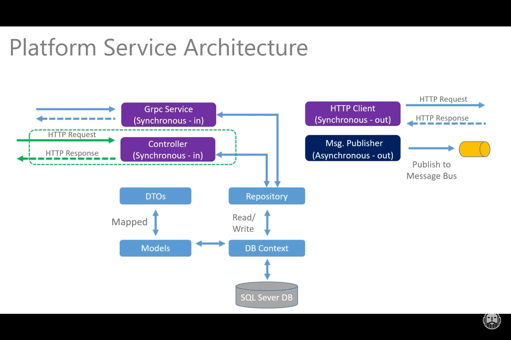
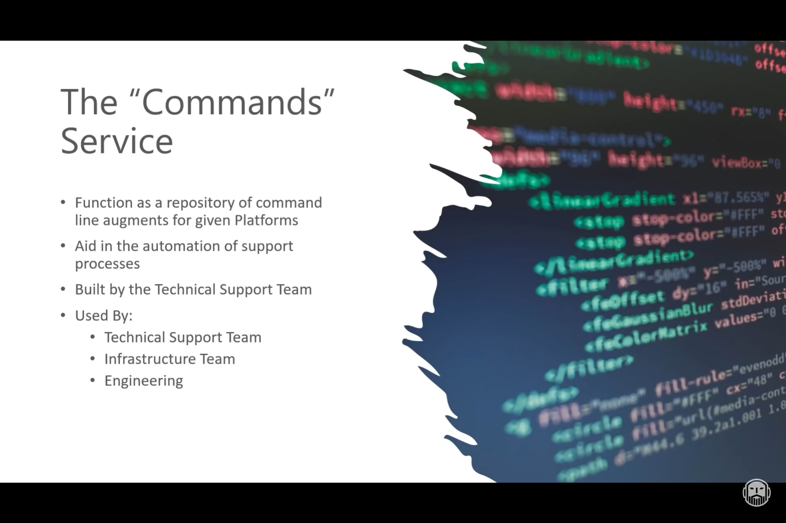
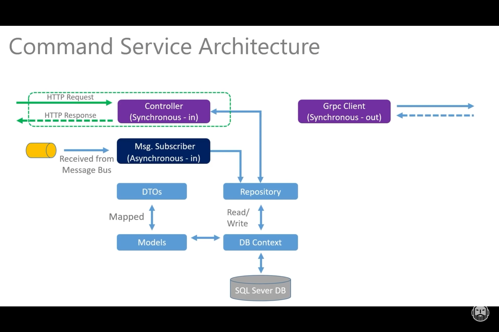

# dotnet-on-k8s
An end-to-end dotnet microservices architecture with k8s, SQL Server on Linux, RabbitMQ and gRPC.

> Built from scratch with: [link](https://www.youtube.com/watch?v=DgVjEo3OGBI)

## Solution Architecture

Overall solution Architecture

### Service 1: Platform

### Service 2: Command Service

# Gotchas

If VSCode namespaces aren't found - we need to restart OmniSharp.

`CTRL + SHIFT + P` -> `Restart Omnisharp`. 